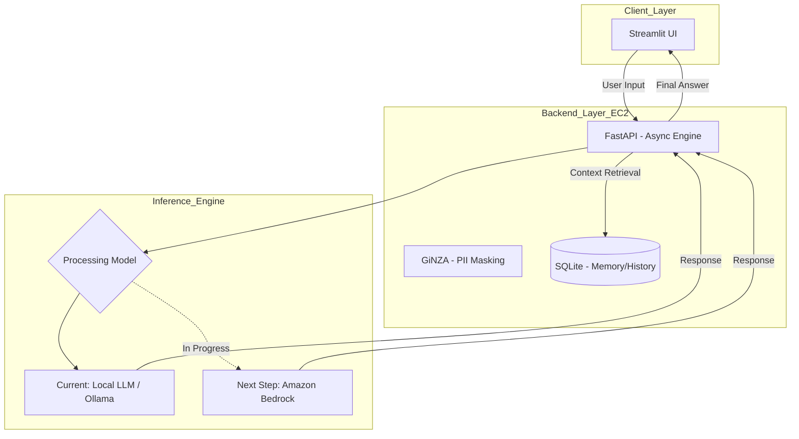

# AI Health Advisor App 🚀

健康診断データに基づき、パーソナライズされたアドバイスを提供するAIエージェントです。
現在、**「プライバシーの完全担保（Local LLM）」**から、**「実用的な応答速度と知能の両立（Managed LLM）」**へのアーキテクチャ移行を推進しています。

## 🏛️ アーキテクチャ設計思想（P-QLC+R）

LLMエンジニアとして、単なる実装にとどまらず、以下の5つの指標を軸にインフラの最適化を行っています。

- **Privacy (P)**: 外部APIへデータを投げない Local LLM 運用をベースとし、個人情報保護を最優先。
- **Quality (Q)**: 現状は小型モデル（Llama 3.1等）だが、複雑な履歴分析には Claude 3.5 Sonnet 等への拡張を予定。
- **Latency (L)**: `async/await` による非同期処理を導入し、サーバーリソース（EC2）の占有を回避。
- **Cost (C)**: 固定費（EC2）内での推論と、必要に応じた従量課金APIの使い分けによる最適化。
- **Resilience (R)**: 特定のプラットフォームに依存せず、API制限時にもローカルで継続稼働できる冗長性。

### 🛰️ システム構成（現状とロードマップ）



## 🏗️ 技術スタック
- **Frontend**: Streamlit(Async UI)
- **Backend**: FastAPI (Python 3.11)
- **AI Engine**: Ollama / Qwen3 (Transitioning to Bedrock)
- **Natural Language Processing**: GiNZA / spaCy (ja_ginza)
- **Database**: SQLite / SQLAlchemy
- **Infrastructure**: EC2 / Docker / Docker Compose / Nginx /Let's Encrypt
- **Editor**: GitHub Copilot / Cursor / Cline


## 📂 プロジェクト構成

```text
ai-health-app/
├── app.py                # Frontend: Streamlit UI
├── main.py               # Backend: FastAPI Router
├── engine.py             # AI Logic: マスキング・LLMプロンプト・推論
├── schemas.py            # Data Models: Pydanticによる型定義（バリデーション） 
├── database.py           # Infrastructure: SQLAlchemyによるDB(SQLite)操作 
├── health_app.db         # SQLite Database (自動生成)
├── requirements.txt      # 依存ライブラリ (SQLAlchemy, Pydantic等)
├── Dockerfile            # Backend用コンテナ
├── Dockerfile.frontend   # Frontend用コンテナ
└── docker-compose.yml    # サービス全体の定義
```

## 🔒 セキュリティについて
本アプリはAI（外部/ローカルモデル）へデータを送信する前に、必ず engine.py 内の mask_entities 関数を通過させ、個人情報を [Person] や [Location] といったタグに置き換えます。これにより、プライバシーを保護した状態での相談を可能にしています。


## 💾 データ管理と整合性
本プロジェクトでは、スケーラビリティと保守性を考慮し、以下のライブラリを採用しています。

- **Pydantic (schemas.py)**: 
  APIのリクエスト/レスポンスの型を厳密に定義。不正なデータ入力を未然に防ぎ、フロントエンドとの契約（Contract）を明確にしています。
- **SQLAlchemy (database.py)**: 
  ORM（Object-Relational Mapping）を採用。現在は SQLite を使用していますが、将来的に PostgreSQL 等の商用DBへ移行する際も、最小限のコード修正で対応可能な設計です。
- **時系列データの管理**: 
  `created_at` に日本標準時（JST）を明示的に設定し、健康データの時系列分析を正確に行えるようにしています。